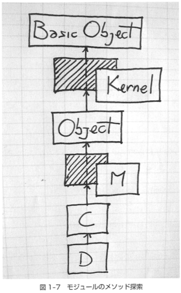

# 前回の復習

# 前回の疑問解消

## [`include`をした時の正確な動作](https://github.com/laysakura/ruby-benkyokai/issues/11)

それを知るために、簡単なモジュールとクラスを定義します。

```ruby
[1] pry(main)> module M
[1] pry(main)*   def a
[1] pry(main)*     'Hello from M#a() '
[1] pry(main)*   end
[1] pry(main)* end
=> nil
[2] pry(main)> class C
[2] pry(main)*   include M
[2] pry(main)* end
=> nil
[3] pry(main)> class D < C
[3] pry(main)* end
=> nil
```

では、各クラスの継承関係を見ていきます。

```ruby
[4] pry(main)> D.superclass
=> C
[5] pry(main)> C.superclass
=> Object
[6] pry(main)> Object.superclass
=> BasicObject
[7] pry(main)> BasicObject.superclass
=> nil
```

`D < C < Object < BasicObject` となっていて、モジュール`M`はクラスの継承関係に入っていません。

しかし、当然ながらクラス`D`のインスタンスからモジュール`M`で定義したメソッドを呼ぶことはできます。

```ruby
[8] pry(main)> D.new.a
=> "Hello from M#a()"
```

実際、`D`から`M`の情報を全く辿れないわけでなく、 **継承チェーン** を調べると`M`が出てきます。

```ruby
[11] pry(main)> D.ancestors
=> [D, C, M, Object, PP::ObjectMixin, Kernel, BasicObject]
```

この動作を深く理解するには、Rubyのメソッド探索方法を理解する必要があります。

`D.new`によって生成されたインスタンスをレシーバにしてメソッド`a`が呼ばれた際、まず`D`の中からメソッド`a`を探索します。
もしそこに`a`がなければ、継承チェーンを上に辿っていって`a`を探します。
今回は`M`まで見にいって`a`が見つかるので、`M#a()`を実行します。

継承チェーンがあってそれを下から探索する、とさえ理解していれば良いですが、もう少し詳しく話します。
Rubyはメソッド探索をする際、クラスのメソッドしか見ません。モジュールのメソッドは見ないです。
ではどうしてモジュールに定義したメソッドが見つかるかというと、モジュールが`include`された時にそのモジュールをラップする無名クラスが自動的に作成され、その無名クラスが継承チェーンに入るのです。



(『メタプログラミングRuby』より)

この絵の影の部分がモジュールをラップしている無名クラスです。

つまり、モジュールを`include`した際の動作は次のとおりです。

1. `include`されたモジュールが無名クラスにラップされる
1. 継承チェーンの中で、`include`したクラスのすぐ上に無名クラスが挿入される


## [モジュールの`include`が継承よりも「いい」理由](https://github.com/laysakura/ruby-benkyokai/issues/12)

[前回の文脈](https://github.com/laysakura/ruby-benkyokai/blob/master/05/Module-nakatani.md#%E3%83%A2%E3%82%B8%E3%83%A5%E3%83%BC%E3%83%AB%E3%81%AB%E3%82%88%E3%82%8Bmix-in) では、`Compressor`クラスを継承して`Gzip`や`Snappy`クラスを作るよりは、`Compressor`モジュールを`include`して`Gzip`や`Snappy`クラスを作るほうが良いという話をしました。
`Compressor`と`Gzip`にはいわゆる`is-a`関係があるのに、なぜ継承ではだめなのでしょうか。

考えてみると理由はシンプルで、 **`Compressor`は抽象クラスだから** です。
「抽象クラス」はRubyの用語でないのですが、「一部のメソッドがインターフェイスだけ提供されているためインスタンス化できないクラス」のことです。

元の例では、`Compressor`は`compress!`というインターフェイスを提供しています。
これをインスタンス化しても実際に圧縮器としての動作はできないので、`class`にするよりも`module`にしたほうが使い方を明確化できます。

逆に言えば、`is-a`関係があり、継承元もインスタンス化して意味を持つのであれば継承を使うべきです。
例えば、単体でもログを出力する機能を持つ`Logger`クラスを継承して、ANSIカラーコードによる色付きログを出力する`ColorfulLogger`を継承する場合などが考えられます。

***************************************************

Q.

MySQLとSQLiteを操作するクラス、`Mysql`と`Sqlite`をそれぞれ作る。
共通の操作(`execute_sql`など)はまとめて`Rdbms`に入れようとしているのだが、このとき`Rdbms`はモジュールで実装して`include`するのが良いか、クラスで実装して継承するのが良いか?
理由も付けてお願いします。

***************************************************


## [ActiveSupportの文脈で出てきた`alias`の正体](https://github.com/laysakura/ruby-benkyokai/issues/13)

島田お願いします!


# Rubyでのテストとデバッグ

# 宿題
